# GitVault

A desktop application for everything Git keeps about *who you are* and *what your repositories
are* — and for changing it without having to trust that you typed the command correctly.

It finds every Git identity artifact on a machine: author identities across all four configuration
scopes, SSH keys in every format the tools produce, running agents, credential stores, and the
per-client settings of third-party Git GUIs. Then it edits them — along with the repositories
themselves: configuration, remotes, branches, tags, commit metadata and file content through a
history rewrite, path-wide operations, the plain-text control files, hook scripts, working trees,
stashes and submodule records.

Windows 10 1809+, macOS 12+, Linux glibc 2.31+ (x64 and arm64). Avalonia 11 on .NET 8.

**No network calls. No telemetry. No auto-update.**

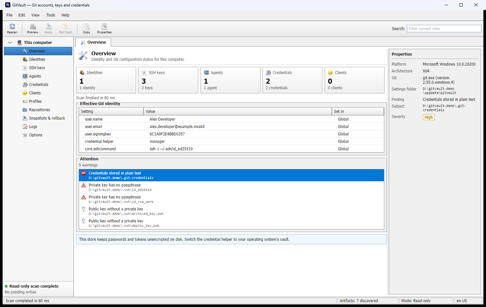

---

## The idea

Git spreads a single question — *which identity is active here, and why* — across a system
configuration file, a per-user one, a repository one, a worktree one, conditional includes,
environment variables, an SSH agent, an `ssh_command` override and whatever a GUI client wrote
behind your back. Answering it usually means running six commands and holding the precedence
rules in your head.

GitVault answers it on one screen, and then lets you act on the answer.

The second half of the application does the things people reach for `git filter-repo`,
`git rebase -i` and a text editor to do — correct an address committed a hundred times, take a key
out of every commit that ever held it, fix a commit message from last month, move a file so that
history reads as though it had always lived there — with a preview of exactly what will happen and
a way back afterwards.

---

## Every write takes the same road

This is the part worth reading before anything else, because everything in the application is
arranged around it.

**Nothing is written until you have seen what will be written.** Planning and applying are
separate calls that return and accept a plan object. The interface can only apply a plan it
already holds and already showed you — the dry-run rule is enforced by the shape of the API, not
by remembering to check a flag.

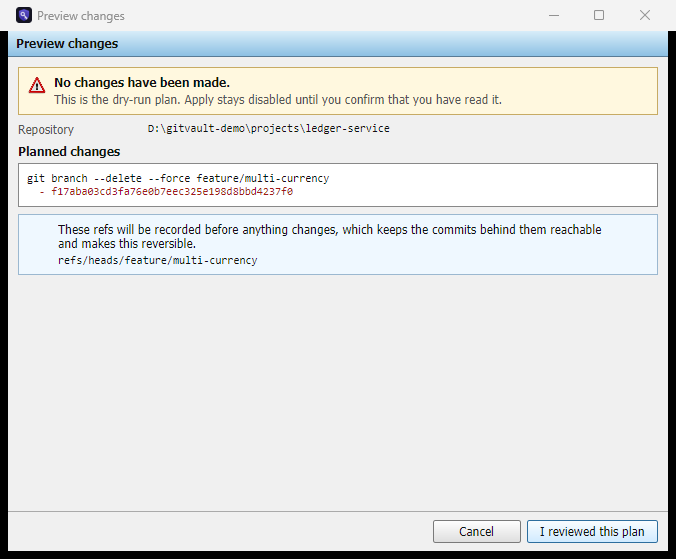

**The preview names the command that will run.** Not a description of it, not an equivalent — the
very arguments the applier hands to git.

**Whatever is about to change is preserved first.** Ordinary files are copied into a snapshot;
anything ref-shaped is recorded as a ref under `refs/gitvault/backup/`. That distinction matters:
a ref may live in a loose file, in `packed-refs`, or in both, and copying whichever file happens to
hold it today preserves an implementation detail rather than the fact worth preserving. A backup
ref also keeps orphaned commits *reachable*, so `git gc --prune=now` cannot discard them — which
the tests demonstrate by running exactly that command after a branch deletion.

**A blocker and a warning are different things.** A blocker is something you cannot do: deleting
the branch you are standing on, rewriting with a dirty working tree, a name git would reject. A
warning is something you may not want to: deleting a branch whose commits exist nowhere else,
rewriting a signed commit, purging a file that has already been pushed. Folding the second group
into the first would make the program refuse work that is legitimately yours.

**`--force` is never passed.** Git refuses to remove a working tree holding uncommitted changes and
refuses to deinitialise a submodule with work inside it. Those refusals are the safety net, so they
reach you as a failed step with git's own message rather than being overridden for a smoother
dialog.

**The repository is never left in a state nobody chose.** No operation stops half-way holding a
conflicted working tree. Where a merge is needed it is *computed* rather than performed — see
[Rewriting history](#rewriting-history).

---

## What it shows

### Identities and keys

Every author identity, which file set it, and which one actually wins. SSH keys in OpenSSH, PEM,
PKCS#8 and PuTTY v2/v3 formats, with fingerprints computed the way `ssh-keygen -lf` computes them —
the tests assert agreement byte for byte against fixtures the reference tools generated.

Private key material is never displayed and never logged. The parsers read the public half and
discard the rest; anything needing a passphrase is delegated to `ssh-keygen` and `ssh-add`.

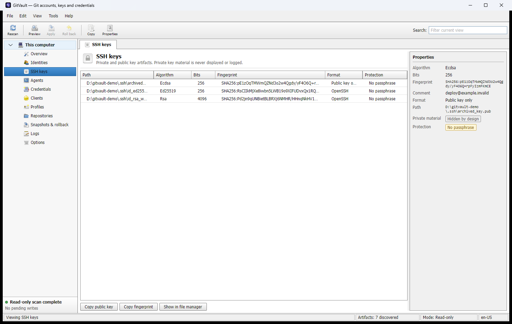

### Health warnings that say what to do

A key readable by other accounts, an RSA key under 3072 bits, a DSA key, a key with no passphrase,
a public key with no private half, a credential store keeping tokens in plain text, a PuTTY file
that fails its own integrity check. Each says what it is and what to do about it.

### Profiles

A named identity — address, key, credential helper, scope — that can be activated and deactivated.
Deactivation restores the touched files byte for byte, including a `[user]` section header that
`git config --unset` would have left behind.

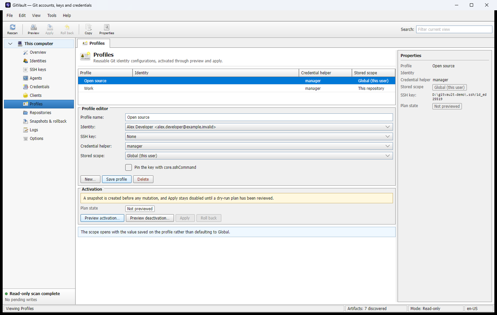

---

## What it edits

Each discovered repository gets a subtree of its own in the navigation tree.

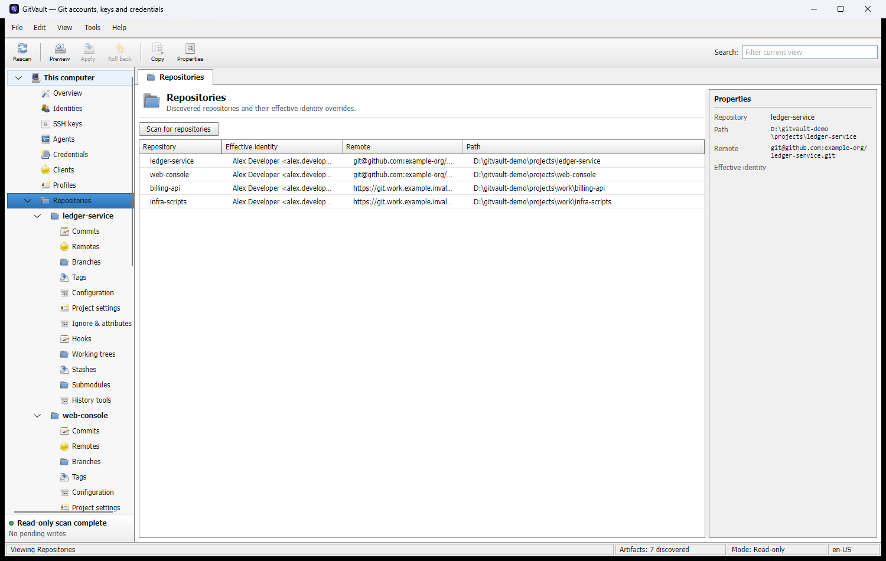

### Refs

Remotes, branches and tags: create, rename, delete, set an upstream. Every deletion records where
the ref pointed before it goes.

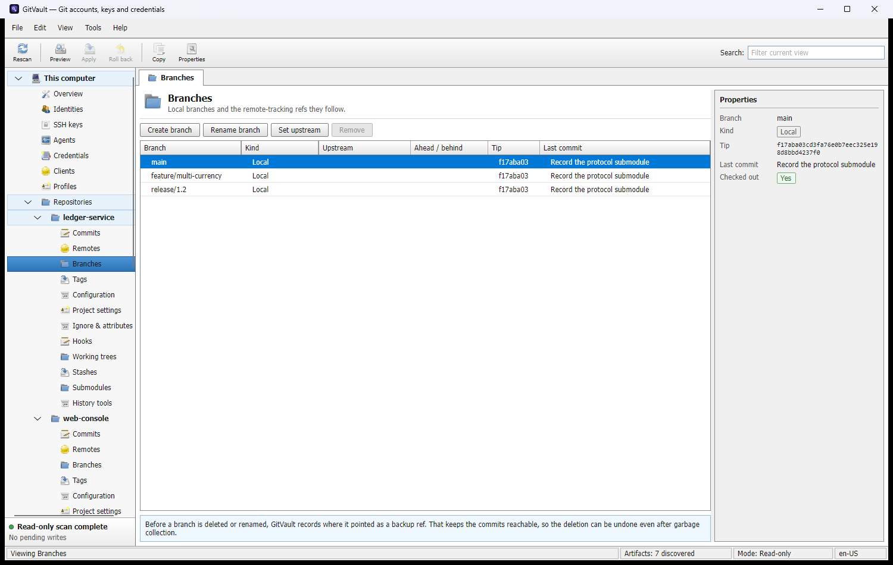

### Commit history

The history page shows everything a rewrite would need to reproduce a commit — both identities,
both dates with the offsets git recorded, the parents, the tree and the signature state — so that
when you edit something you are deciding about facts you can see rather than about a summary.

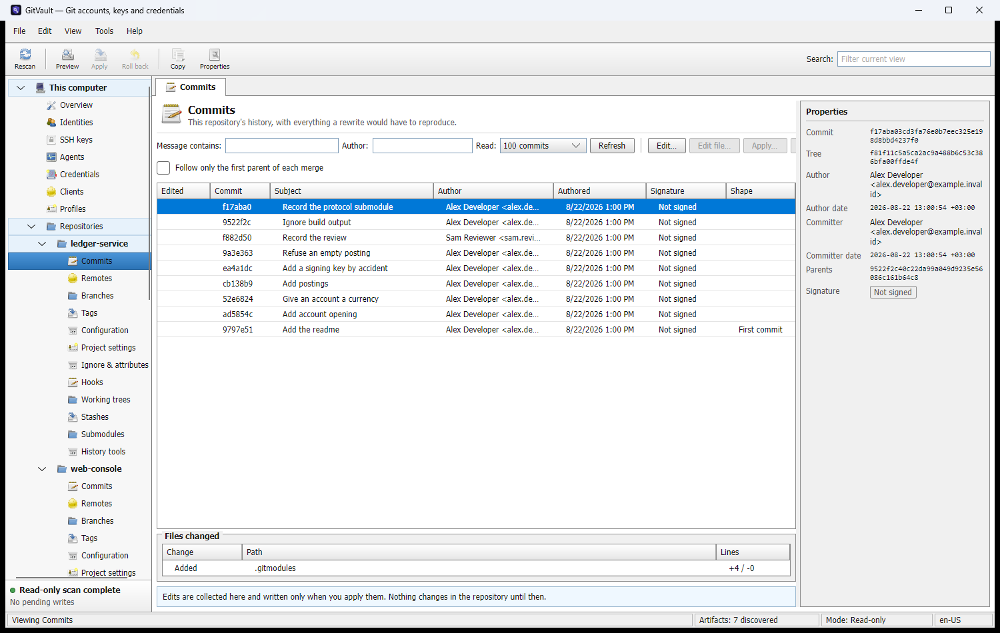

Edits are collected rather than applied one at a time. Rewriting a branch twice in a row would
rebuild the same commits twice and hand them a second set of identifiers for no reason, so
collecting them is also the correct way to do the work.

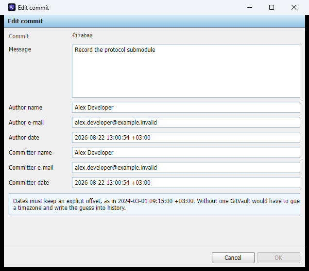

A date typed without an offset is refused rather than interpreted. Guessing a timezone and writing
the guess into history is exactly the kind of silent change this program does not make.

### Rewriting history

Metadata rewriting rebuilds the commit chain with `git commit-tree`, walked from the oldest
affected commit to the tip, each commit rebuilt against its already-rebuilt parents with the tree
it always had. That cannot conflict, and a commit whose inputs did not change rebuilds to the same
object name.

Changing *file content* is the part that can genuinely disagree with itself, because later commits
may have touched the same file. The obvious tool is `git rebase`, and it is deliberately not used:
a rebase resolves conflicts by stopping, leaving the working tree conflicted and the repository in
your hands mid-operation.

GitVault computes the merge instead. For each later commit the file is merged three ways through
`git merge-file`, run on temporary files *outside* the repository. Nothing is written, so conflicts
are found while planning — a preview you close leaves no trace, which the tests assert by counting
loose objects and checking the index timestamp across a full plan.

Confirming a rewrite requires typing the branch name. Every other write is confirmed by
acknowledging a plan; this one reaches every clone of the repository.

### History-wide operations

Remove a file from every commit that ever held it, move one so that history reads as though it had
always lived at the new path, or correct an address that was committed wrongly a hundred times.

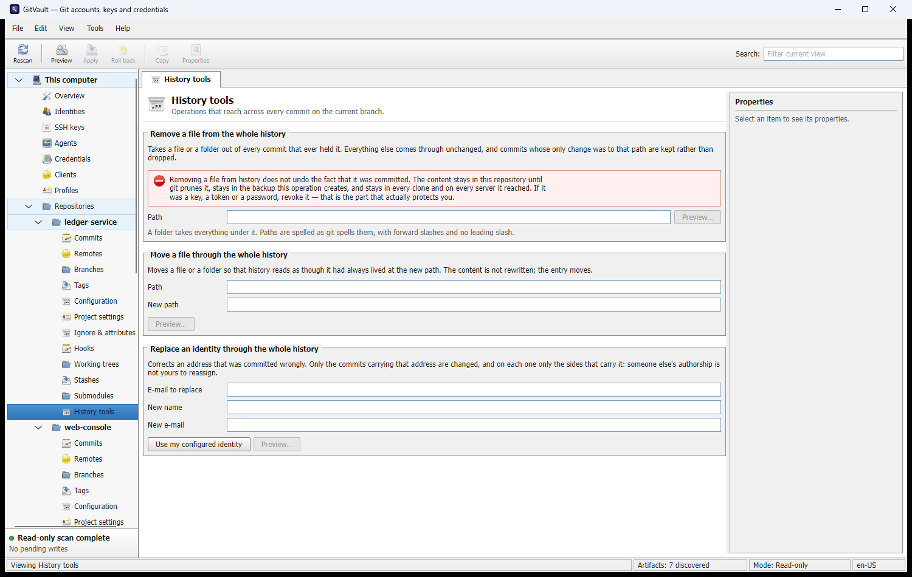

The purge is the operation with a security claim attached, so the interface carries the honest half
at the point of use: removing a file does not unmake the fact that it was committed. The content
stays in the repository until git prunes it, stays reachable through the very backup ref that makes
the purge reversible, stays in every other clone and on any server it reached. **A key, a token or
a password has to be revoked.** A test asserts that reachability rather than leaving it to the
documentation.

Two deliberate differences from `filter-repo`: a commit whose only change was to the purged path is
kept rather than dropped — its message and authorship are history too — and an identity replacement
changes only the sides that carry the address, because someone else's authorship is not yours to
reassign.

### Hooks

The one place this program installs software, and treated as such.

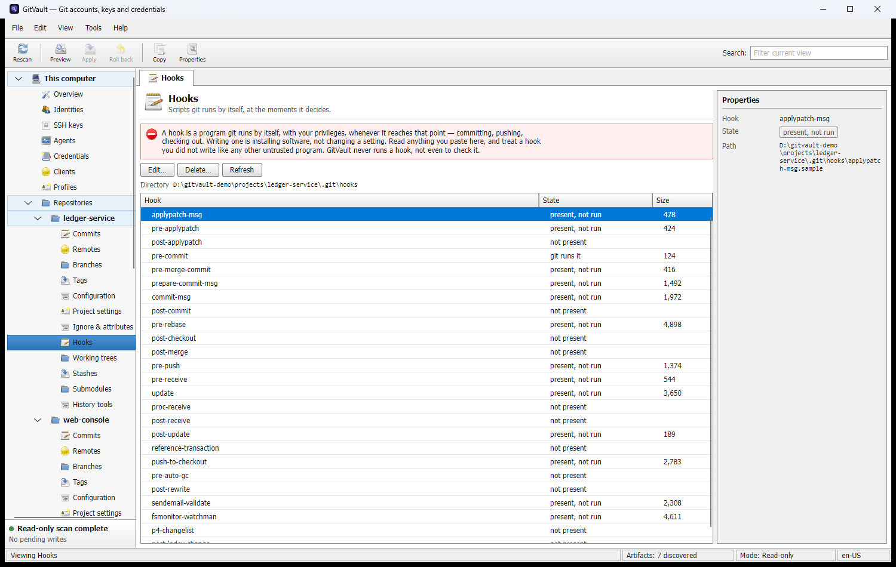

GitVault never runs a hook — not to validate it, not to check its syntax, not to offer a test. A new
hook starts as a shebang line and nothing else. The hooks directory is asked of git rather than
assumed, because `core.hooksPath` redirects it and writing to `.git/hooks` regardless would report
success while git ran something else. Enabling and disabling use git's own `.sample` suffix rather
than the executable bit, which is not reliable across platforms.

The page also names two states git says nothing about: a hook that is present, enabled and skipped
anyway because the file is not executable, and a hook that is a compiled binary, which is refused
for editing rather than silently replaced with text.

### Working trees, stashes and submodules

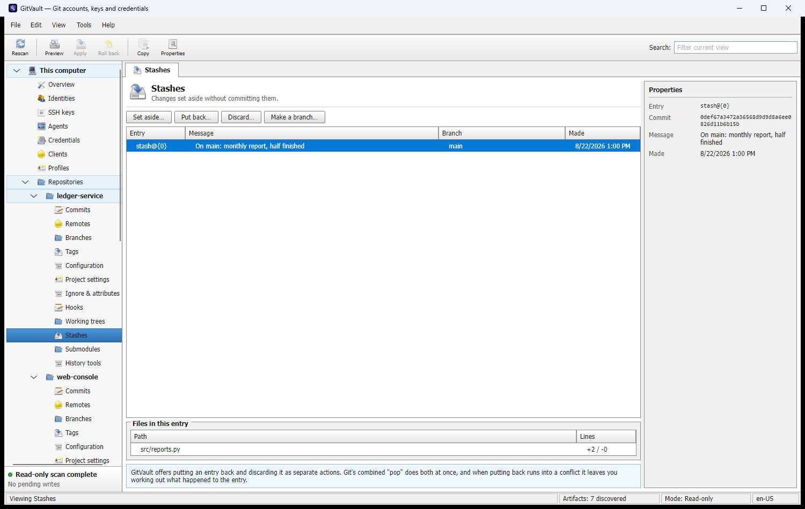

There is no "pop". Git's combined pop applies a stash and then drops it, and when the apply
conflicts you are left working out how much landed and whether the entry survived. Putting an entry
back and discarding it are separate buttons with separate previews, and the page says why. Dropping
preserves the entry's commit as a backup ref first, which is the only thing that makes it
recoverable.

Submodules stop where the network starts. Initialising and updating both need a fetch, so neither
is offered — the page states that before the buttons rather than after a failure. What is left is
the address the parent records, which is what actually goes wrong when a repository moves or when
you authenticate over SSH rather than HTTPS.

### Ignore, attributes, mailmap

`.gitignore`, `.gitattributes`, `.mailmap` and `.git/info/exclude`. The file's own line ending
survives a round trip, bytes that would not survive being decoded and written back are refused
rather than re-encoded, and the page says whether the file is committed — because editing
`.gitignore` reaches everyone once you commit it while the exclude file never leaves your clone.

---

## Build, test, run

Requires the .NET 8 SDK (`global.json` pins the 8.0.4xx feature band).

```bash
dotnet restore GitVault.sln
```

```bash
dotnet build GitVault.sln --configuration Release
```

```bash
dotnet test GitVault.sln --configuration Release
```

```bash
dotnet run --project src/GitVault.App/GitVault.App.csproj
```

Package for the current platform — see [docs/packaging.md](docs/packaging.md):

```bash
pwsh build/windows/pack.ps1 -Runtime win-x64 -Version 0.1.0
```

```bash
./build/macos/pack.sh osx-arm64 0.1.0
```

```bash
./build/linux/pack.sh linux-x64 0.1.0
```

## Running against a workspace of your own

```bash
dotnet run --project src/GitVault.App -- --data-root /some/throwaway/directory
```

`--data-root` moves everything GitVault reads and writes — the home directory, the SSH directory,
the per-user git configuration, its own settings, snapshots and logs. It also drops the machine's
system git configuration, its credential vault and its installed clients, so a relocated run reads
nothing outside its root.

It exists because the alternative does not work: Windows resolves the user profile and the
application-data folder through the operating system rather than the environment, so redirecting
`USERPROFILE` and `APPDATA` moves nothing. Two jobs need it — producing documentation that contains
nobody's real identity, and exercising the destructive parts of the manual test plan without your
own keys within reach.

Every screenshot in this file was taken that way. Build the same workspace with:

```bash
pwsh build/demo-workspace.ps1 -Workspace /some/throwaway/directory
```

---

## Testing

744 tests. `GitVault.Core` sits at 81 % line coverage, gated in CI:

```bash
pwsh build/check-coverage.ps1
```

The gate collects the coverage itself rather than reading whatever is lying in the results
directory. It did the latter once, and reported the same figure for weeks while nothing was being
measured — a gate that cannot fail is not a gate.

The engine tests run against **real repositories driven by real git** in a throwaway environment,
not against a mock. A test that asserts a rewrite preserved a tree, or that a purged blob is still
reachable through its backup, is only worth anything if git agrees.

The manual plan the automated suite cannot cover — real key stores, real permissions, DPI, fonts —
is [docs/manual-qa.md](docs/manual-qa.md), with throwaway fixtures built by:

```bash
pwsh build/qa-fixtures.ps1 -Workspace /some/throwaway/directory
```

---

## Interface

A classic Windows desktop utility: menu bar, toolbar, navigation tree, dense grids, a shared
properties pane, group boxes, modal dialogs and a status bar. The reference is the generation of
administration tools it belongs beside — a management console rather than a web application in a
window.

Styling lives in `src/GitVault.App/Styles/`: one palette file and three style sheets. They override
Avalonia's Fluent templates by property rather than replacing them, which keeps the surface small
enough to audit — and carries one hazard the tests now guard, that a property the palette does not
name is still supplied by the theme, per variant. A field whose caret colour came from the theme
was invisible on a machine set to dark mode.

Icons are the **Tango Icon Library 0.8.90, public domain**. The generator downloads the artwork and
the upstream `COPYING` together, so the licence claim is checkable rather than asserted:

```bash
pwsh build/generate-classic-icons.ps1
pwsh build/generate-appicon.ps1
```

Nothing is fetched at runtime — the images ship inside the assembly.

## Localization

English, Russian and Simplified Chinese. `build/loc/strings.json` is the single source of truth for
every user-visible string; the `.resx` files and `Keys.g.cs` are generated from it:

```bash
pwsh build/generate-localization.ps1
```

Generating all three cultures from one file makes it structurally impossible for the key sets to
drift. Three tests enforce the rest: no user-visible literal in XAML or C#, no string that nothing
can reach, and no key named in the interface that the resource file does not declare.

---

## Layout

```
src/GitVault.Core/           domain model, abstractions, orchestration — zero OS dependencies
src/GitVault.Platform.*/     the only OS-specific code, one project per platform
src/GitVault.Clients/        probes for third-party Git clients, plus JSON manifests
src/GitVault.Localization/   en-US / ru-RU / zh-Hans resources and the runtime culture switch
src/GitVault.App/            Avalonia UI, view models, composition root
tests/                       unit, integration-against-real-git and headless-UI tests
build/                       generators, fixtures and packaging scripts
```

Business logic never branches on the operating system.
`src/GitVault.App/Composition/PlatformModule.cs` is the single place that does, and everything
downstream depends only on interfaces.

One rule runs through the whole codebase and is worth stating on its own: **ask git; never deduce
what git decided.** The first serious defect here was a snapshot and a write addressing different
files because the per-user configuration path had been guessed rather than resolved. The same rule
now covers the system configuration path, the hooks directory, and every ref a plan touches.

---

## Documentation

| Document | What it is |
|---|---|
| [docs/architecture.md](docs/architecture.md) | how each subsystem works and why it is shaped that way |
| [docs/security.md](docs/security.md) | every security requirement, and plainly what is met, partly met and not built |
| [docs/manual-qa.md](docs/manual-qa.md) | the pre-release manual plan, 157 cases across 31 sections |
| [docs/packaging.md](docs/packaging.md) | producing installers per platform |
| [docs/v0-verification.md](docs/v0-verification.md) | the verification pass over existing functionality, and the defects it found |
| [docs/agent-prompt.md](docs/agent-prompt.md) | onboarding brief for an AI agent working on this repository |

Known gaps are listed in tables at the end of the security document and the QA plan, rather than
left implicit.

## Licensing

All third-party packages are MIT, Apache-2.0, BSD or MPL-2.0. `FluentAssertions` is pinned to
6.12.2 because 7.x moved to a proprietary licence. The icon set is public domain.
